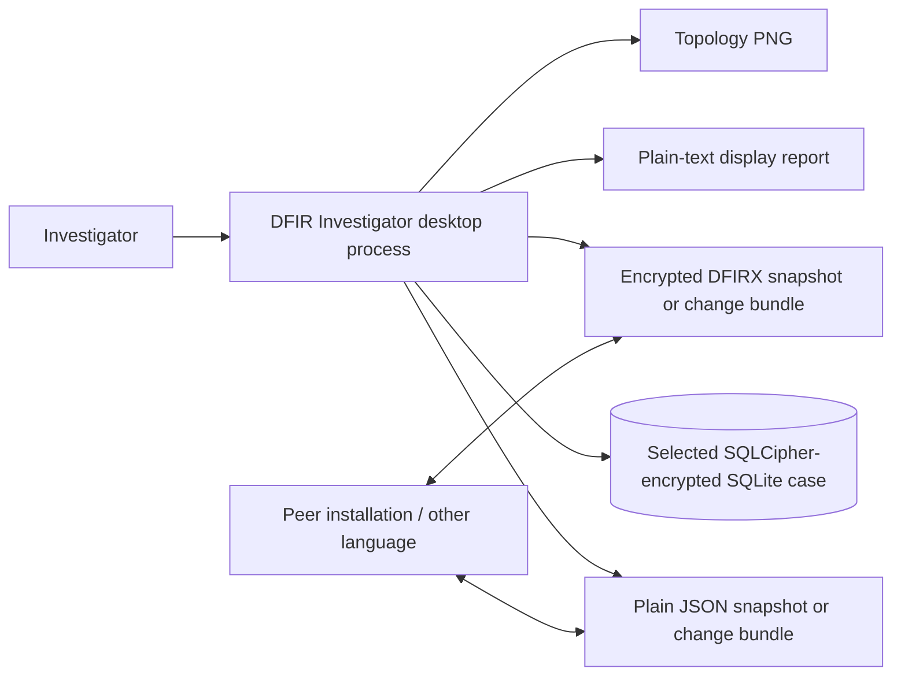
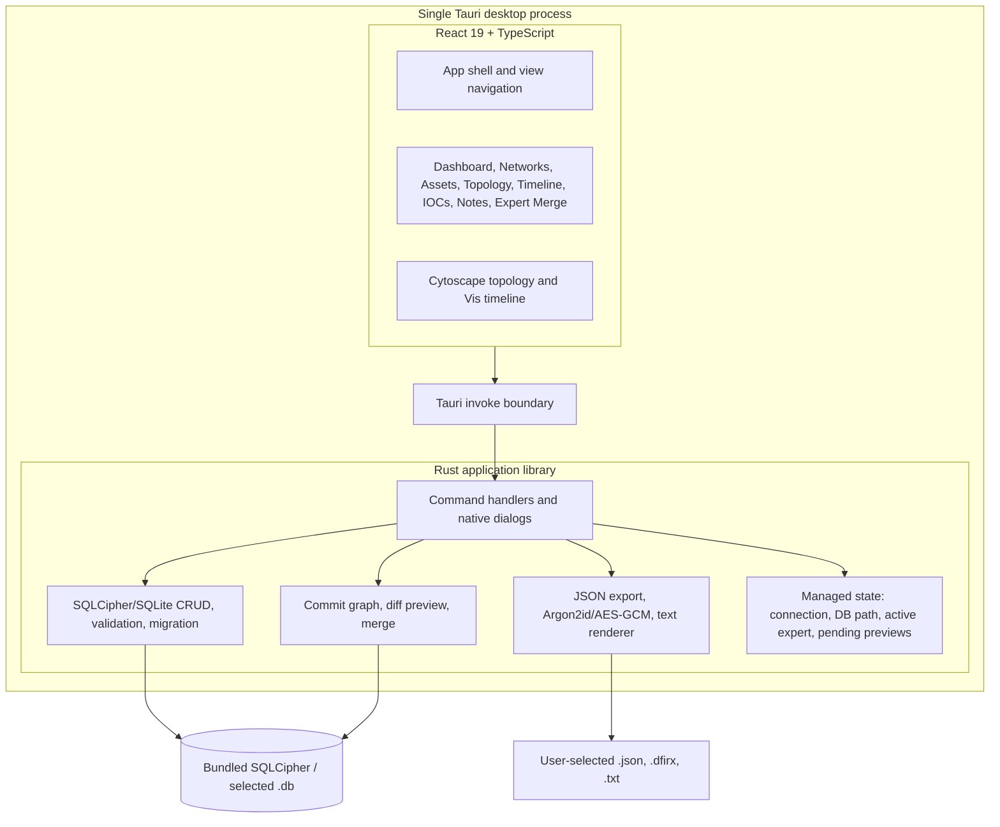
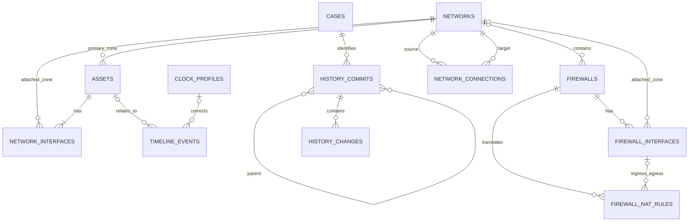
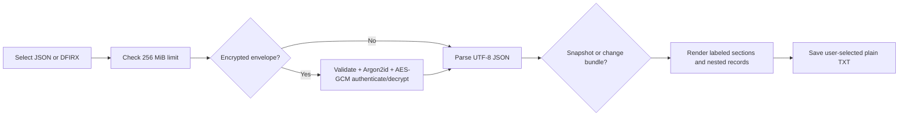

# DFIR Network Investigator Architecture

Document version: 1.0  
Application version: 1.0.20
Last reviewed: 2026-07-18

## 1. Architectural objective

The application is a lean, offline, single-user-at-a-time desktop workbench. It intentionally avoids an HTTP API, daemon, database server, cloud service, account directory, and always-on collaboration layer.

The deployed process contains:

- a React user interface rendered in the platform WebView through Tauri;
- in-process Tauri IPC commands;
- Rust domain, validation, history, merge, encryption, and file-dialog logic; and
- one SQLCipher connection to the currently unlocked case.

This design prioritizes portability, low deployment overhead, operation in disconnected environments, and investigator control of case files.

## 2. System context



Only paths selected through native dialogs are used for creating/opening cases and importing/exporting portable files. Production operation does not require a listening network port.

## 3. Application structure



### 3.1 Frontend

| Area | Implementation |
|---|---|
| Framework | React 19, TypeScript strict mode, Vite |
| Styling | Tailwind CSS and a reduced shadcn/Radix component set |
| Topology | Cytoscape.js with Dagre and alternative layouts |
| Timeline | Vis Timeline and Vis Data |
| State | Component state and typed Tauri invocations; no remote state store |
| Navigation | In-process view selection; no browser router or web endpoints |
| Error feedback | Toasts and form messages from standardized command responses |

### 3.2 Rust/Tauri layer

`DbState` maintains:

- `Mutex<Option<Connection>>`: one open SQLite connection;
- `Mutex<Option<PathBuf>>`: current case path;
- `Mutex<Option<ActorIdentity>>`: active expert and optional focus; and
- an in-memory map of loaded expert bundles and their current previews.

It deliberately does not retain the database password or export password. SQLCipher derives the live connection key during open; the Rust password input is zeroized after the command returns. React clears password fields after each operation, although JavaScript runtimes cannot guarantee deterministic memory zeroization.

Commands return a consistent envelope:

```json
{
  "success": true,
  "data": {},
  "error": null
}
```

Commands are grouped into:

- case lifecycle and metadata;
- network, connection, and firewall CRUD;
- asset and network-interface CRUD;
- timeline, IOC, and note CRUD;
- history and expert merge;
- snapshot export/import;
- portable encryption/decryption; and
- read-only text rendering.

### 3.3 Storage layer

SQLCipher Community Edition is bundled through `rusqlite` with vendored OpenSSL; no SQLite server or separately installed database engine is needed. The application applies the password through SQLCipher's native key API before any schema read. Each unlocked connection enables:

```sql
PRAGMA foreign_keys = ON;
PRAGMA busy_timeout = 5000;
```

The current schema version is `PRAGMA user_version = 5`.

### 3.4 Database unlock lifecycle

1. New case: validate a minimum 6-character password, create and key the file, create schema/case metadata, validate it, and keep the keyed connection open.
2. Existing case: select a file, reject a plaintext SQLite header, apply the entered password, prove the schema can be read, migrate/validate it, and run SQLCipher plus SQLite integrity checks.
3. Expert session: collect a self-declared attribution name only after an existing database unlock. It has no relationship to the encryption key.
4. Rekey: independently verify the current password, call SQLCipher rekey on the open connection, then reopen and integrity-check with the new password.
5. Lock/close: drop the connection, path, active expert, and pending import previews. The next open requires the file password again.
6. Legacy migration: keep the plaintext source intact, create a new destination, copy through SQLCipher's supported export path, then open and validate the encrypted copy.

The password is semantically scoped to a physical database file. It is not stored in a global application profile or derived from a username/case UUID. SQLCipher stores its salt and authenticated encrypted pages, not a recoverable plaintext password.

## 4. Data model

One database contains exactly one case. Investigation tables therefore do not repeat `case_id` on every row. UUID strings provide stable entity identities for export, history, and merge.



### 4.1 Investigation entities

| Table | Purpose | Important fields |
|---|---|---|
| `cases` | Single persistent case record | name, description, client, status, timestamps, optional metadata; an obsolete investigator field is retained only for file compatibility |
| `networks` | Logical network zones | name, CIDR subnet, LAN/DMZ/DMS/WAN/etc. type, VLAN, description |
| `assets` | Computers and devices | primary zone/IP/MAC projection, type, OS, user, compromise status, investigation status, JSON properties/scan results |
| `network_interfaces` | Physical/logical NICs and multi-homing | asset, interface name, IP, MAC, optional network, primary flag |
| `network_connections` | Logical links between zones | source, target, connection type, device, description |
| `firewalls` | Dedicated firewall records | primary/home network projection, name, vendor, model, legacy JSON rules, configuration text |
| `firewall_interfaces` | Multi-interface firewall addressing | firewall, interface name, multiple IPv4/IPv6 addresses or CIDRs, MAC, zone, VLAN, role, primary flag, description |
| `firewall_nat_rules` | Structured address/port translation | VIP/DNAT/SNAT/port-mapping type, protocol, source, original and translated addresses/ports, ingress/egress interfaces, enabled state |
| `clock_profiles` | Reusable server clock correlations | raw server/reference values, independent timezones, normalized UTC values, millisecond offset |
| `timeline_events` | Evidence chronology | optional asset, preserved raw time/zone, clock profile and copied offset, corrected UTC timestamp, precision, type, description, severity, source, MITRE |
| `iocs` | Indicators of compromise | type, value, description, threat level, first/last seen |
| `notes` | Versioned investigator notes | title, Markdown text, created/updated timestamps |

### 4.2 Primary-interface projection

Legacy and simple consumers expect network, IP, and MAC on `assets`. The normalized source for multiple NICs is `network_interfaces`.

The invariant is:

- at most one primary interface exists per asset, enforced by a partial unique index;
- changing the primary interface synchronizes `assets.network_id`, `ip_address`, and `mac_address`;
- legacy assets are backfilled with a primary interface during migration; and
- the topology places the asset inside the primary network and draws explicit edges to secondary networks.

This model retains backward compatibility while representing multi-homed endpoints correctly.

### 4.3 Status model

Asset compromise state:

- `unknown`;
- `clean`;
- `suspected`; and
- `infected`.

Investigation progress:

- `not_started`;
- `in_progress`; and
- `completed`.

The two dimensions are deliberately separate. A clean system may still require additional work, and an infected system may already have completed triage.

### 4.4 History entities

| Table | Purpose |
|---|---|
| `history_commits` | Author name, session ID, message, optional scope, timestamp |
| `history_commit_parents` | Ordered parent links, allowing merge commits with two history parents |
| `history_changes` | Entity operation, base/new revisions, before/after JSON, incoming source change ID |
| `history_entity_heads` | Current revision and deletion state per entity UUID |
| `history_state` | Current head and shared baseline commit |

History is append-only through normal application workflows. Entity rows represent current state; history rows provide attributed before/after changes and merge ancestry.

## 5. Validation, migration, and integrity

### 5.1 Opening a case

Before exposing a selected database to the UI, the Rust layer:

1. opens it as SQLite;
2. enables foreign keys and the bounded busy timeout;
3. requires the expected core tables;
4. requires exactly one case record;
5. runs `user_version` migrations;
6. repairs supported legacy orphan network references;
7. backfills primary interfaces;
8. initializes/reconciles history state;
9. runs `PRAGMA integrity_check`; and
10. runs `PRAGMA foreign_key_check`.

Validation occurs before normal mutation of the opened case.

### 5.2 Domain validation

The backend, not only the UI, validates:

- required text;
- CIDR, IP, and MAC syntax;
- known enum values;
- flexible partial/ISO/Unix timestamp parsing, timezone validation, UTC normalization, and checked clock-offset arithmetic;
- IOC first/last-seen ordering;
- JSON stored in asset properties, scan results, and firewall rules;
- foreign-key existence and network dependencies; and
- not-found behavior for update/delete operations.

### 5.3 Transaction boundaries

Transactions cover multi-table operations such as:

- entity edit plus history commit;
- asset/interface synchronization;
- asset deletion and timeline unlinking;
- snapshot import;
- dependency-sensitive operations; and
- application of selected expert-merge changes.

An error rolls back the complete operation.

## 6. Timeline architecture

Timeline events are manual evidence records, not bulk-ingested raw logs. The architecture provides:

- preserved source timestamp and source timezone;
- corrected UTC RFC 3339 storage at fixed millisecond output precision;
- 24-hour `DD-MM-YYYY HH:mm:ss.SSS` display in a selected zone beside UTC/local;
- partial date/time input with missing components normalized to zero;
- ISO/RFC 3339 and Unix epoch seconds/milliseconds/microseconds/nanoseconds;
- IANA timezone rules with rejection of ambiguous/nonexistent daylight-saving wall times;
- reusable server clock profiles calculated from same-instant server and trusted reference observations;
- optional stable asset UUID relationship;
- continued evidence retention if an asset is deleted;
- source, severity, event type, and MITRE context;
- table and graphical timeline views; and
- client-side search/filtering applied to both views.

The model avoids grouping solely by asset name, which prevents name collisions from blending two endpoints. The event copies the applied millisecond offset so editing a profile cannot silently rewrite recorded evidence. See [TIME_CORRELATION.md](TIME_CORRELATION.md).

## 7. Expert history and merge architecture

### 7.1 Identity and scope

`ActorIdentity` contains a self-declared name, random session UUID, optional scope label, and selected network IDs. It is operational attribution only. It is not authentication, authorization, or a digital signature.

Scope is deliberately soft: it filters assigned assets and records context in commits while allowing an expert to act outside the original assignment after confirmation.

### 7.2 Change-bundle structure

A bundle includes:

- format and version;
- bundle UUID and case UUID;
- shared baseline and expert head commit IDs;
- exporter name and timestamp; and
- ordered commits with parents, scopes, and before/after entity changes.

Only commits on the expert's main path after the shared baseline are exported.

### 7.3 Preview and three-way comparison

The receiving master:

1. rejects a different case UUID;
2. checks whether the stated baseline is known;
3. aggregates sequential incoming changes by entity;
4. compares baseline, current master, and incoming values by field;
5. classifies clean, auto-mergeable, conflicting, delete-conflicting, or already-applied changes; and
6. holds the bundle in memory without mutating SQLite.

For object-shaped entities, fields changed only by the incoming expert can be combined with unrelated local edits. A field changed differently on both sides requires a team decision.

### 7.4 Apply

Selected resolutions are ordered by dependency, applied in one transaction, and recorded as a merge commit. Imported source change IDs support repeat detection. Interface merges reconcile the primary asset projection before commit.

After one bundle is applied, remaining loaded previews are recalculated against the new master state.

## 8. Snapshot and portable data structures

### 8.1 Plain snapshot

The versioned `ExportData` envelope contains:

```text
format_version
exported_at
case_info
networks[]
assets[]
network_interfaces[]
clock_profiles[]
timeline_events[]
notes[]
iocs[]
firewalls[]
network_connections[]
```

The output is formatted UTF-8 JSON. Legacy snapshots without newer defaulted fields remain readable.

Snapshot import requires the same case UUID. It inserts missing records in dependency-safe order, skips existing UUIDs, does not overwrite current case metadata, and returns inserted/skipped counts.

### 8.2 Plain change bundle

The bundle is formatted UTF-8 JSON with `format: "dfir-investigator-changes"` and `format_version: 1`. It is optimized for attributed review and merge rather than complete backup.

### 8.3 Encrypted portable envelope

When a password is supplied, the exact plain JSON bytes become the authenticated encrypted payload in a `.dfirx` envelope.

| Parameter | Value |
|---|---|
| KDF | Argon2id version 19 |
| Salt | Fresh random 16 bytes per file |
| Memory | 65,536 KiB |
| Iterations | 3 |
| Parallelism | 1 |
| Derived key | 32 bytes |
| Cipher | AES-256-GCM |
| Nonce | Fresh random 12 bytes per file |
| Authentication tag | 16 bytes, appended to ciphertext |
| Associated data | `DFIR-Investigator portable export v1` |
| Outer encoding | Versioned UTF-8 JSON with standard padded Base64 fields |

The importer validates fixed KDF/cipher parameters before allocating KDF memory, verifies field lengths, authenticates before exposing plaintext, and zeroizes the backend password/key copies under its control. Portable input is limited to 256 MiB.

The full language-neutral contract is in [../PORTABLE_EXPORT_FORMAT.md](../PORTABLE_EXPORT_FORMAT.md).

### 8.4 Plain structured partial import

`format: "dfir-investigator-partial"` version 1 is a deliberately unencrypted, language-neutral patch format. It supports create, update, and upsert operations across all core entities but rejects deletion.

The frontend never applies submitted JSON directly. Rust parses it, checks the case ID, builds complete typed entities from partial fields, and executes the proposal in a rollback-only transaction using the same validation and foreign-key paths as normal edits. The resulting preview contains current/incoming fields and create/update/unchanged/invalid classifications.

The selected subset is dry-run again immediately before confirmation. Apply rejects stale previews, missing selected dependencies, and any relationship error, then commits all accepted changes plus one attributed history commit in a single transaction. Pending previews are held only in process memory. See [PARTIAL_IMPORT.md](PARTIAL_IMPORT.md).

## 9. Text parser architecture

The parser is a read-only portable-file renderer:



It does not acquire logs, parse arbitrary forensic evidence, connect to SQLite, or support reverse import from text. See [TEXT_PARSER.md](TEXT_PARSER.md).

## 10. Security architecture

### 10.1 Trust boundaries

| Boundary | Control |
|---|---|
| React to Rust | Tauri command allowlist generated into the process; standardized typed responses |
| WebView content | Restrictive local CSP; no remote application content |
| Filesystem | Native Rust operations after user selection; frontend filesystem plugin and broad filesystem permissions are absent |
| Database | Foreign keys, migrations, integrity checks, validation, transaction boundaries |
| Portable encrypted file | Password KDF plus authenticated encryption; fixed/versioned envelope |
| Collaboration identity | Self-declared names and local history; no cryptographic identity assurance |

The Tauri capability set allows core functions and native open/save dialogs only.

### 10.2 Data-at-rest matrix

| Data | Application protection | Security boundary |
|---|---|---|
| Closed SQLite case | SQLCipher page encryption/authentication | Per-file database password plus file custody; retain approved recovery material |
| Open SQLite case | Decrypted through the keyed process | Endpoint/process security and physical custody |
| Plain JSON | None by design | External file handling controls |
| Encrypted DFIRX | Argon2id + AES-256-GCM | Password strength/separation and file custody |
| Plain text report | None by design | External file handling controls |
| Topology PNG | None by design | External file handling controls |
| Runtime memory | Plaintext while in use | Endpoint/process security |

SQLCipher database encryption and DFIRX export encryption are independent. Database rekey does not alter existing exports, and an export password cannot unlock the database. Full-disk encryption remains recommended to protect surrounding endpoint metadata and temporary/runtime material.

### 10.3 What encryption does and does not prove

AES-GCM detects wrong passwords and ciphertext modification. It does not prove who authored a bundle because all holders of the password can create valid encrypted envelopes. Headquarters requiring non-repudiation should add an organizational digital-signature workflow outside this release.

## 11. Deployment and build

The authoritative operator/developer command reference is [RUNNING_AND_BUILDING.md](RUNNING_AND_BUILDING.md). Accepted data inputs and partial-import fields are specified in [INPUT_FORMATS.md](INPUT_FORMATS.md).

### Production artifacts

- Windows standalone executable and verified NSIS setup executable;
- Linux x86_64 Debian package and AppImage when built on Ubuntu/Debian; and
- macOS `.app` and `.dmg` artifacts for Intel, Apple Silicon, or universal distribution when built on macOS.

### Build toolchain

- Node.js 20+;
- Rust stable native to the build host;
- Windows: MSVC host, Visual Studio Build Tools with Desktop C++, Windows SDK, WebView2 Runtime, and Strawberry Perl for the vendored OpenSSL build;
- Linux: Ubuntu/Debian x86_64 build host with WebKitGTK/AppIndicator/rsvg/pkg-config/patchelf development packages; and
- macOS: Xcode Command Line Tools plus the Intel, Apple Silicon, or universal Rust targets.

### Release gates

```powershell
npm run lint
npm run build
npm test
cd src-tauri
cargo fmt --check
cargo test
cd ..
npm run tauri-build:windows
```

For Linux use `npm run tauri-build:linux` on Ubuntu/Debian x86_64. For macOS use `npm run tauri-build:mac-intel`, `npm run tauri-build:mac-apple`, or `npm run tauri-build:mac-universal` on macOS. At the documented review point, lint, frontend tests, Rust tests, production build, NSIS packaging, and the packaged responsive-window launch check pass. Linux and macOS artifacts must be built and smoke-tested on their target operating systems before release records claim support. Test counts are intentionally not hard-coded here because they change as coverage grows.

## 12. Explicit non-goals and limits

The current architecture does not include:

- backend or database servers;
- application accounts, verified identity authentication, RBAC, or per-expert authorization;
- live concurrent database editing or real-time collaboration;
- automated endpoint discovery, evidence collection, log ingestion, or log parsing;
- YARA execution;
- STIX/OpenIOC or standardized PDF reporting;
- attack-path computation;
- database-password recovery or organizational key escrow; or
- cryptographic signing of expert identity or bundles.

These exclusions keep the deployed surface lean but must be considered during operational approval.

## 13. Authoritative sources

The current implementation is defined by:

- `src/` for the React UI and public TypeScript types;
- `src-tauri/src/db.rs` for schema, migration, validation, and CRUD;
- `src-tauri/src/history.rs` for attributed history and merge;
- `src-tauri/src/portable_export.rs` for encrypted envelopes and text rendering;
- `src-tauri/src/lib.rs` for Tauri commands and native file workflows; and
- `src-tauri/tauri.conf.json` plus `capabilities/default.json` for application security configuration.

The old root PNG diagrams and long-form design proposals are archived concepts and do not describe the implemented desktop architecture.
