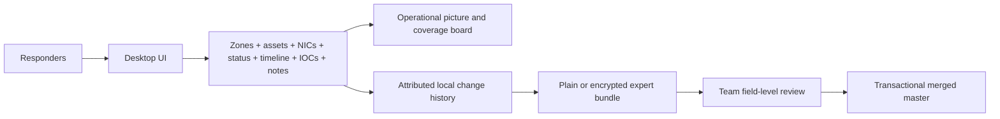

# Headquarters Technical Review

## DFIR Network Investigator — Lean Offline Coordination Workbench

Document version: 1.0  
Application version reviewed: 1.0.20
Review date: 2026-07-18  
Review basis: implemented source, automated gates, Windows release build, and launch verification

## 1. Decision summary

### Recommended decision

Approve the application for a controlled operational pilot as an offline manual DFIR documentation, common-operating-picture, and end-of-day expert-merge tool, subject to the handling controls in this review.

Do not represent it as:

- an automated evidence collector or log-analysis platform;
- a replacement for a SIEM, EDR, forensic acquisition suite, or case-management system;
- an authenticated multi-user system;
- a cryptographically signed chain-of-custody system; or
- an application-encrypted live evidence repository.

### Executive assessment

The design directly addresses a common response problem: multiple experts build partial and sometimes conflicting mental models while moving between computers, rooms, departments, and network zones. The application consolidates those observations into a shared structure:

- zone and connection map;
- computer and NIC configuration;
- explicit compromise and investigation status;
- evidence timeline;
- IOC and note records; and
- attributed, reviewable changes.

The most important value is not a new analytic algorithm. It is reduction of coordination friction and cognitive ambiguity. Responders can see what is known, what is suspected, what is incomplete, where a computer is connected, and what another expert changed. This should reduce avoidable “wandering between computer nodes” and the fog/blindness of the first response phase.

Those benefits are expected from the implemented workflow but have not yet been quantified in a formal field time-and-motion study. A pilot should measure them using the proposed indicators in Section 13.

## 2. Operational problem

During the initial phase of an incident, responders often face:

- incomplete or outdated network diagrams;
- unknown system ownership and physical location;
- uncertainty about which computers have been checked;
- multi-homed systems that are invisible in a simple one-IP spreadsheet;
- findings split across notebooks, chat, screenshots, and individual memory;
- timeline observations with inconsistent timestamps or duplicate host names;
- several experts changing independent copies of the same plan; and
- a costly end-of-day effort to decide which edits belong in the master record.

This creates two forms of waste.

### Movement and search waste

An expert may revisit a computer because its status was not visible, walk to the wrong room or zone, or repeat configuration discovery already performed by another person.

### Cognitive waste

The team repeatedly reconstructs the current picture from fragmented information. Early uncertainty becomes a “foggy” mental model: topology, infection state, work coverage, and sequence of events are mixed together and held differently by each responder.

DFIR Network Investigator creates a single structured workspace for that incomplete picture and allows it to become progressively more accurate.

## 3. Solution overview

The product is a local desktop application built with React inside Tauri. Rust performs local domain operations and talks directly to bundled SQLite. One case is one user-selected `.db` file. Windows is the currently verified packaged release in this review; Linux x86_64 and macOS Intel/Apple Silicon are supported as native Tauri build targets and require platform-native build and smoke-test evidence before operational distribution.

There is no server, HTTP API, database service, cloud dependency, account system, or live synchronization service.

## 4. Capability assessment

The authoritative detailed assessment, including disposition of obsolete conclusions and the worked 30-machine scenario, is [CAPABILITY_ASSESSMENT.md](CAPABILITY_ASSESSMENT.md). The summary below distinguishes implemented documentation capability from automation or proof.

| Capability | Implemented assessment | Operational value |
|---|---|---|
| Case creation/open | User-selected validated SQLite file; one case at a time | Portable deployment and explicit custody |
| Session expert attribution | Entered per open work session and attached to changes | Matches field reality where identity cannot be strongly proven |
| Network zones | Create/edit/search/delete with CIDR/type/VLAN validation | Establishes the investigation map |
| Network links | Create/edit/search/delete source/target links | Records routing and logical reachability assumptions |
| Firewalls | Dedicated records with vendor/model/config text plus multiple interfaces, multiple addresses per interface, zone/VLAN/MAC/role and a primary/home interface | Makes perimeter and multi-zone control points visible |
| NAT/VIP mappings | Structured VIP, DNAT, SNAT and port mappings with protocol, original/translated endpoints and ingress/egress interfaces | Preserves observed translation design as editable, mergeable records |
| Assets | Create/edit/search/filter with OS/user/IP/MAC and JSON details | Central endpoint inventory |
| Compromise state | Unknown/clean/suspected/infected | Separates security judgment from work progress |
| Investigation progress | Not started/in progress/completed | Provides a coverage board and assignment queue |
| Multi-NIC | Multiple interfaces, one primary, secondary-zone links | Exposes bridging, management, routing, and lateral paths |
| Topology | Compound network graph, status styling, layouts, PNG output | Converts lists into a visual common operating picture |
| Timeline | Optional raw/correct times, reusable server-clock corrections, UTC normalization, dual-zone display, filters and MITRE context; unrelated dates remain valid independent findings | Establishes chronology without inventing causality |
| IOCs | Create/edit/search/filter with threat and time metadata | Central indicator list |
| Notes | Versioned safe Markdown preview | Preserves reasoning and handover context |
| Local audit history | Name/session/scope/timestamp plus before/after values | Shows who claimed each change and what changed |
| Expert merge | Baseline-based bundles, three-way field comparison, selective transactional apply | Reconciles independent field teams without blind overwrite |
| Snapshot backup | Full versioned JSON and same-case skip-without-overwrite import | Backup and legacy transfer |
| Plain portable export | Human/machine-readable UTF-8 JSON | Interoperability with other software and languages |
| Encrypted portable export | Password-portable Argon2id + AES-256-GCM `.dfirx` | Protects exported data in hostile/secret environments |
| Text parser | Read-only snapshot/bundle to plain `.txt` | Briefing and review without importing a case |

## 5. How the design reduces responder time

### 5.1 Coverage-driven dispatch

The asset list separates compromise state from investigation progress. A coordinator can filter `not started` or `in progress` systems instead of asking every responder what remains. This supports the next assignment without walking the site to rediscover coverage.

Expected effect:

- fewer duplicate computer visits;
- fewer missed computers;
- faster shift handover; and
- clearer completion criteria.

The application does not automatically discover assets or verify physical work. The reduction depends on timely, accurate updates by responders.

### 5.2 Network-aware navigation

Zones, VLANs, links, firewalls, primary NICs, and secondary NICs are represented explicitly. Dedicated firewalls support multiple interfaces and IPv4/IPv6 addresses, while VIP, DNAT, SNAT, and port mappings are normalized records instead of opaque prose. A responder can inspect the expected location, translations, and connections before moving to another node.

Multi-NIC modeling is especially important. A single-host row in a spreadsheet may hide a second management or cross-zone interface; the graph makes that additional attachment visible.

Expected effect:

- less movement to the wrong zone or device;
- earlier recognition of unexpected paths;
- better prioritization of bridge, jump, management, or dual-homed systems; and
- fewer repeated `ipconfig`/interface-discovery conversations.

### 5.3 One operational picture instead of many mental pictures

The dashboard, topology, statuses, timeline, IOCs, and notes provide different views of the same UUID-based records. The team can update an incomplete picture incrementally rather than waiting for a perfect diagram.

Expected effect:

- reduced context switching between spreadsheets, paper, and chat;
- faster answers to “what do we know now?”;
- visible uncertainty through `unknown`, `suspected`, and incomplete statuses; and
- less cognitive load during the high-pressure first phase.

### 5.4 Stable evidence chronology

Timeline events preserve the raw server/log value and its declared timezone, then store a corrected UTC instant with millisecond output precision. The parser accepts partial 24-hour `DD-MM-YYYY`, ISO/RFC 3339, and Unix epochs. IANA timezone rules handle historical offsets and reject ambiguous/nonexistent daylight-saving wall times.

Reusable server clock profiles calculate the difference between a server reading and a trusted reference reading observed at the same instant. Applying that offset across related events replaces repeated manual subtraction while retaining the raw value, profile attribution, and copied offset for review and expert merge. The table shows selected-zone and UTC/local values together; stable asset IDs, source, severity, MITRE context, search, and filters remain available.

Expected effect:

- less time manually normalizing chronology;
- substantially less repeated clock/timezone arithmetic across logs from misconfigured servers;
- lower risk of combining same-named computers;
- quicker selection of events relevant to one system or period; and
- better support for team briefings.

### 5.5 Structured end-of-day reconciliation

Experts do not exchange entire databases and guess which copy is newest. Each bundle carries attributed commits since a shared baseline. The team sees additions, edits, deletes, and same-field conflicts before changing the master.

Expected effect:

- shorter merge meetings;
- fewer overwritten findings;
- explicit ownership of conflict decisions;
- repeat-import detection; and
- a reproducible next baseline for the following work period.

## 6. Expert collaboration model

### Operating pattern

1. The lead marks an agreed history head as the shared baseline.
2. Identical database copies are distributed to experts.
3. Experts enter their names and optional department/room/zone focus.
4. Each edit is committed locally with author, session, scope, time, and before/after state.
5. Experts export bundles containing main-path commits after the baseline.
6. Headquarters/lead loads bundles into the master as previews.
7. The team selectively accepts changes and resolves same-field conflicts.
8. The application applies accepted work as one transaction and records a two-parent merge commit.
9. Remaining previews are recalculated against the updated master.
10. The new agreed head becomes the next baseline.

### Merge safeguards

- Different case IDs are rejected.
- Loading does not mutate the database.
- Unknown baselines are not silently trusted.
- Existing source change IDs identify repeated work.
- Field-level three-way comparison distinguishes unrelated edits from actual conflicts.
- Dependency ordering preserves relational validity.
- Multi-NIC changes reconcile the asset's primary projection.
- Complete apply failure rolls back the transaction.

### Identity limitation

There are deliberately no expert accounts, identity proof, RBAC, or per-expert authorization. “Alice changed IP” means the active unlocked session declared the name Alice. It does not prove Alice's identity and is not non-repudiation. Separately, every physical database file requires a shared password to decrypt it; that password controls file access, not identity.

This model is suitable where a physically controlled team prioritizes speed and accountability labels over account infrastructure. It is not suitable where policy requires verified identity, separation of duties, or signed approvals without additional controls.

## 7. Encryption and data protection

### 7.1 Data-at-rest capability by artifact

| Artifact | Application encryption | Headquarters interpretation |
|---|---|---|
| Closed SQLite `.db` | Yes | SQLCipher page encryption/authentication using a password scoped to that physical file copy |
| Open SQLite `.db` | Plaintext available to process | Endpoint controls, physical custody, and full-disk protection remain required |
| Plain snapshot/change JSON | No by design | Interoperable and inspectable; use only under appropriate handling controls |
| Encrypted `.dfirx` export | Yes | Portable password protection independent of investigator and computer |
| Text-parser report | No | Deliberately readable output; treat as sensitive cleartext |
| Topology PNG | No | Sensitive clear image |
| Process memory | Plaintext while open | Endpoint compromise can expose active content/password material |

The product provides two independent encryption domains: SQLCipher for the live case database at rest and the portable DFIRX envelope for selected exports. A database password cannot decrypt an export and an export password cannot unlock a database.

### 7.2 Encrypted database design

- SQLCipher Community Edition is compiled into the desktop binary through `rusqlite`; vendored OpenSSL supplies its cryptographic primitives.
- The password is applied through SQLCipher's native key API before schema access. SQLCipher derives the database key from its per-file salt; the application does not store a recoverable password record.
- A minimum of 6 characters is enforced. Operational policy should require stronger passwords where the threat environment permits. Wrong passwords and damaged encrypted files fail before case data is exposed.
- New/open/rekey operations run encrypted-page integrity checks in addition to normal SQLite and foreign-key checks.
- **Lock / Close Case** drops the keyed connection and active attribution session. Rekey changes only the open physical copy.
- A byte-for-byte copied database initially keeps the same password. Copies of the same logical case can later use different passwords without changing their case UUID or merge compatibility.
- Supported legacy plaintext databases are converted to a separately selected encrypted copy; the source is preserved for deliberate handling.

Limitations: no password recovery or central escrow is provided; an unlocked process and compromised endpoint can expose data; file names and separately generated JSON/text/PNG remain outside SQLCipher; expert identity remains self-declared. SQLCipher Community Edition attribution and license terms are included in the distribution documentation.

### 7.3 Encrypted export design

The encrypted format preserves the exact ordinary snapshot or change-bundle JSON as its plaintext payload.

Technical profile:

- Argon2id version 19;
- fresh random 16-byte salt;
- 65,536 KiB memory, 3 iterations, parallelism 1;
- 32-byte derived key;
- AES-256-GCM;
- fresh random 12-byte nonce;
- 16-byte authentication tag;
- fixed associated data binding the format version; and
- versioned JSON envelope with standard Base64 fields.

Properties:

- machine-independent import/export;
- password independent of the session expert name;
- no password stored in the case or file;
- ciphertext integrity/authenticity under the shared password;
- wrong-password and file-modification detection; and
- language-neutral specification for independent implementations.

The backend validates fixed parameters before KDF memory allocation, authenticates before parsing plaintext, limits portable input to 256 MiB, and zeroizes password/key copies under Rust's control.

### 7.4 Encryption limitations

- There is no password recovery.
- Password sharing remains an operational process.
- A weak/shared password reduces confidentiality.
- AES-GCM proves knowledge of the password, not author identity.
- SQLCipher does not protect generated plain JSON/text/PNG or an already unlocked process.
- Endpoint malware or a privileged local user can access data while the application is open.

Recommended control: transfer `.dfirx` files and passwords through separate approved channels, retain protected backups/database-password recovery material, and continue organization-managed endpoint encryption.

## 8. Technical architecture and attack surface

### Architecture

- React 19 and TypeScript UI inside the platform WebView through Tauri;
- Rust 2021 command/domain layer;
- bundled SQLCipher/SQLite through `rusqlite`, with vendored OpenSSL;
- Cytoscape.js topology and Vis timeline;
- native open/save dialogs; and
- native Windows, Linux, or macOS production builds.

### Reduced runtime surface

- no HTTP backend;
- no exposed API port in production;
- no PostgreSQL/Redis service;
- no cloud credentials;
- no authentication database;
- no frontend filesystem plugin;
- narrow Tauri capabilities for core and dialogs; and
- local-only content security policy.

### Database controls

- foreign keys enabled on every connection;
- five-second busy timeout;
- schema version migrations;
- single-case validation;
- legacy orphan repair;
- integrity and foreign-key checks;
- UUID identities;
- validated JSON/text/network/time inputs;
- safe dependency-aware deletion; and
- transactional multi-table operations/import/merge.

This is a smaller and more inspectable surface than a multi-service deployment, but endpoint security remains the primary trust anchor.

## 9. Text parser and briefing capability

### Structured partial intake

The workbench generates a case-aware plain JSON template that can be completed by a person, deterministic parser, or approved LLM. It supports a single field patch, selected entity sections, or conversion of a full plain snapshot into proposed upserts.

Operational control is retained locally: parsing performs no mutation; records are classified and shown field-by-field; the reviewer selects Skip, Add missing only, or Use incoming versions; and the exact subset is dry-run before a final confirmation and single transactional/audited apply. Deletion is not accepted through this format. Timeline and notes can be retained together, added without overwriting matching UUIDs, or explicitly updated from incoming matching UUIDs.

This reduces re-keying effort without treating probabilistic LLM output as trusted evidence. The generated reference catalog can itself contain sensitive case identifiers, hostnames, IP addresses, and evidence labels, so use of an external model remains an organizational disclosure decision.

The Text parser accepts a plain or encrypted snapshot/change bundle and produces a structured `.txt` report. It does not connect to or mutate SQLite.

Snapshot output includes case, networks, assets, asset NICs, connections, firewalls, firewall interfaces, structured NAT/VIP mappings, timeline, IOCs, and notes. Change-bundle output includes identifiers, exporter details, commits, scopes, and nested changes.

Advantages:

- headquarters can receive readable material without installing the full workbench;
- encrypted transport can be converted only at the authorized presentation point;
- the source case is not opened or changed; and
- other languages can independently decrypt/render the documented JSON format.

Control point: the resulting text is cleartext and may contain the complete sensitive case. It must be handled accordingly.

## 10. Capacity and performance posture

The product targets manually curated incident-response datasets, not high-volume telemetry.

Current characteristics:

- one local SQLite connection and one open case;
- synchronous local commands with short transactions;
- indexed common foreign keys and timeline timestamp;
- client-side filtering and visualization;
- 256 MiB maximum portable input; and
- no automated raw-log storage or ingestion.

No formal maximum counts for assets, events, or history commits have been benchmarked. Large graphs and timelines will eventually be constrained by WebView memory/rendering rather than a database server. A pilot should use representative case sizes and define acceptable interaction latency before wider approval.

## 11. Advantages

### Operational

- Works without client internet, SIEM, or server installation.
- Starts with partial knowledge and supports progressive refinement.
- Shows both infection judgment and work completion.
- Represents multi-NIC and cross-zone reality.
- Reduces fragmented records and repeated verbal reconstruction.
- Supports focused assignments without blocking necessary cross-zone work.
- Produces visual and text briefing artifacts.

### Collaboration

- Preserves attributed additions, edits, and deletions.
- Avoids blind last-writer-wins database replacement.
- Makes field conflicts explicit to the meeting.
- Applies accepted changes atomically.
- Establishes a reproducible shared baseline.

### Technical/deployment

- No backend or database server to install, patch, expose, or recover.
- SQLCipher preserves the SQLite data model and can be inspected by compatible tools when the file password is supplied.
- Plain JSON supports interoperability.
- Encrypted `.dfirx` supports protected portable exchange.
- Versioned structures permit controlled evolution.
- Small permission and CSP surface.

### Cost and support

- Low infrastructure requirement.
- No server operations dependency during field work.
- Standard native desktop packaging for Windows, Linux, and macOS build hosts.
- Open, inspectable local data formats.

## 12. Limitations and deferred capabilities

| Limitation | Impact |
|---|---|
| No automated discovery/collection | Records are only as current as investigator input |
| No log parser/ingestion | Timeline is manually curated; not suitable for bulk telemetry |
| No identity authentication/RBAC | Names are self-asserted; the shared file password does not establish identity or access roles |
| No live collaboration | Experts work on copies and merge at defined points |
| No database-password recovery | Loss of the only password/recovery record can make that physical case copy unavailable |
| No digital signatures | Bundle author is not cryptographically verified |
| No PDF/standard report | Text and JSON are available; formal report generation remains external |
| No STIX/OpenIOC | IOC interoperability is plain JSON/text only in this release |
| No YARA or attack-path analytics | Tool documents conclusions; it does not generate them |
| No formal large-case benchmark | Pilot must establish sizing envelope |
| No application password recovery | Loss of a `.db` or `.dfirx` password means loss of that protected copy |

The archived root design document and PNGs mention FastAPI, PostgreSQL, Redis, RBAC, logs, YARA, PDF, and other components. They are not implemented and should not be used in approval material.

## 13. Pilot measurement plan

To validate the expected time and cognitive benefits, measure the following against a comparable existing workflow.

| Indicator | Suggested measurement |
|---|---|
| Time to first usable network picture | From team start to zones, first assets, and links visible |
| Asset coverage completeness | Percentage with explicit investigation status at each coordination checkpoint |
| Duplicate visits/work | Count of computers examined twice without a documented reason |
| Unlocated/missed nodes | Count discovered late that were absent from the shared picture |
| Time to answer status questions | Time to report infected/suspected/not-started systems and affected zones |
| Timeline reconciliation time | Time to produce an agreed incident sequence |
| End-of-day merge time | From first bundle load to new shared baseline |
| Merge conflicts | Count, type, and resolution duration |
| Handover clarification requests | Questions needed after shift transition |
| Data-handling incidents | Plain exports/reports stored or sent contrary to procedure |
| Interaction performance | Load/filter/topology response at representative entity counts |

Headquarters should avoid claiming a percentage time reduction until these indicators are collected in controlled exercises or real deployments.

## 14. Required operating controls

For a controlled pilot:

1. Use organization-managed full-disk or approved container encryption on every responder endpoint in addition to SQLCipher.
2. Keep the encrypted live `.db` inside the protected location and retain its password/recovery record under approved procedure.
3. Define who owns the master case and who may mark a baseline.
4. Distribute identical master copies and record the distribution time/hash through existing procedure.
5. Require unique, recognizable expert names; understand that they remain self-declared.
6. Use encrypted `.dfirx` for sensitive transfer unless approved interoperability requires plain JSON.
7. Keep database and export passwords distinct; transfer export passwords through a separate approved channel and retain no unrecoverable single copy.
8. Treat text/PNG outputs as sensitive cleartext.
9. Do not edit the same SQLite file concurrently over a network share.
10. Keep existing evidence acquisition, hashing, custody, and reporting procedures; this workbench supplements them.
11. Back up the master before a merge meeting and after establishing the next baseline.
12. Define a process for rejecting unknown-baseline or wrong-case bundles rather than bypassing safeguards.

## 15. Assurance evidence at review time

The implemented release passed:

- ESLint;
- TypeScript and Vite production build;
- 7 frontend tests;
- Rust formatting check;
- 23 Rust tests;
- optimized Tauri build under the Windows MSVC toolchain;
- NSIS setup generation; and
- responsive-window launch verification of the packaged executable.

Rust coverage includes schema migration, orphan repair, primary-interface synchronization, safe deletion, transactional snapshot and partial import, same-case enforcement, legacy compatibility, history/merge behavior, selective Notes/Timeline policies, conflict handling, repeat detection, cross-case rejection, portable encryption round trips, SQLCipher wrong-password/rekey behavior, plaintext-to-encrypted migration, wrong-password/tamper rejection, text rendering, and session-expert audit attribution.

Automated tests do not replace an independent security assessment, cryptographic review, usability exercise, or representative-scale benchmark.

## 16. Final assessment

DFIR Network Investigator is technically coherent for its intended lean scope. Its strongest feature is the integration of network structure, endpoint/NIC status, chronology, and attributed expert changes in one offline case. That integration directly targets the operational causes of duplicated movement and early-response confusion.

The design gains simplicity and portability by excluding servers, accounts, and live synchronization. Headquarters should accept the corresponding constraints: SQLCipher protects a closed case file but the endpoint remains the runtime trust anchor, names are not authenticated, password recovery is procedural, and field collaboration occurs through controlled merge meetings.

Subject to those controls, a measured pilot is justified. The recommended approval statement is:

> Approved for controlled use as an offline, encrypted DFIR documentation, topology, coverage, timeline, and expert-merge workbench. Not approved as the sole evidence repository, identity authority, automated analysis platform, or substitute for endpoint security and established chain-of-custody procedure.
