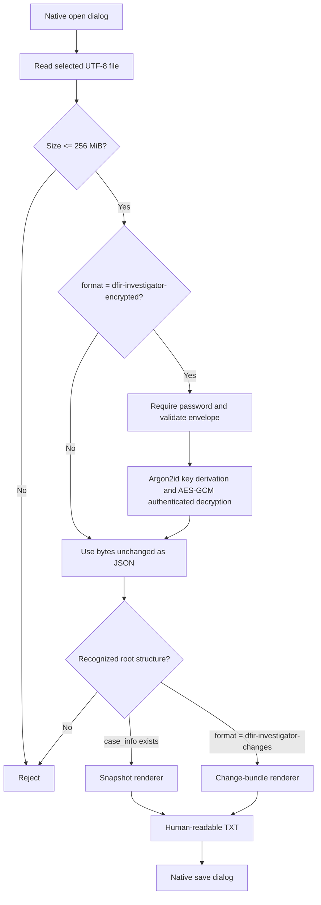

# DFIR Export Text Parser

Document version: 1.0  
Application version: 1.0.20
Last reviewed: 2026-07-18

## 1. Scope

The Text parser is a read-only presentation tool. It converts a supported DFIR snapshot or expert change bundle into a human-readable plain-text file so findings can be displayed, reviewed, printed by another tool, or shared with personnel who do not run the application.

It is intentionally not:

- a raw event-log parser;
- an evidence-ingestion engine;
- a general JSON pretty printer;
- a database converter;
- an import format; or
- a case mutation command.

The parser never opens the current SQLite connection and cannot change investigation records.

## 2. User workflow

1. Open **Expert Merge**.
2. If the source is encrypted, enter its password under **Import / decrypt password**. Leave the field blank for ordinary JSON.
3. Select **Create text report**.
4. Select the `.json` or `.dfirx` input.
5. Select the destination `.txt` file.

The password field is cleared after a successful operation.

The generated text is not encrypted, even when the input was encrypted.

## 3. Processing pipeline



### Security ordering

For encrypted inputs, no decrypted JSON is rendered until AES-GCM authentication succeeds. A wrong password, modified file, truncated file, unsupported algorithm, or invalid cryptographic field length is rejected.

## 4. Accepted input structures

### 4.1 Plain snapshot

Recognition rule: the root JSON object contains `case_info`.

Expected versioned fields:

```text
format_version
exported_at
case_info
networks[]
assets[]
network_interfaces[]
clock_profiles[]
timeline_events[]
notes[]
iocs[]
firewalls[]
firewall_interfaces[]
firewall_nat_rules[]
network_connections[]
```

The renderer accepts defaulted legacy snapshot fields as long as the root remains a supported snapshot.

### 4.2 Plain expert change bundle

Recognition rule:

```json
{
  "format": "dfir-investigator-changes",
  "format_version": 1
}
```

The bundle includes case/baseline/head identifiers, exporter metadata, commits, parent links, scopes, and entity changes with before/after values.

### 4.3 Encrypted portable input

Recognition rule:

```json
{
  "format": "dfir-investigator-encrypted",
  "format_version": 1
}
```

After authenticated decryption, the restored bytes must parse as one of the two plain structures above. See [../PORTABLE_EXPORT_FORMAT.md](../PORTABLE_EXPORT_FORMAT.md) for the complete interoperable envelope specification.

## 5. Renderer structure

The Rust implementation is in `src-tauri/src/portable_export.rs`.

Primary functions:

| Function | Responsibility |
|---|---|
| `decode_portable_text` | Detect plain/encrypted input and authenticate/decrypt when necessary |
| `render_export_text` | Parse JSON and dispatch to a supported renderer |
| `render_case_snapshot` | Produce ordered case sections |
| `render_change_bundle` | Produce bundle summary and commit/change sections |
| `render_collection` | Render arrays with numbered records |
| `render_fields` | Recursively render scalar, multiline, nested object, and object-array values |
| `printable_value` | Convert null, Boolean, number, string, array, or object into text |

The Tauri file workflow is `save_export_as_text` in `src-tauri/src/lib.rs`. It performs the native open/save dialogs and calls the portable decoder and renderer.

## 6. Snapshot output order

The snapshot report uses this order:

1. `DFIR CASE SNAPSHOT` heading;
2. format version and export time;
3. case information;
4. network zones;
5. assets/computers;
6. network interfaces;
7. server clock profiles;
8. network connections;
9. firewalls;
10. firewall interfaces;
11. firewall NAT/VIP/port mappings;
12. timeline events, including raw and corrected clock fields;
13. indicators of compromise; and
14. notes.

Each collection entry is numbered. Its display label is selected from the first non-empty field in this priority order:

```text
name → title → value → description → id
```

All fields are still rendered; the selected label is only a heading aid.

## 7. Change-bundle output order

The bundle report starts with `DFIR EXPERT CHANGE BUNDLE`, followed by:

- format version;
- bundle ID;
- case ID;
- baseline commit ID;
- head commit ID;
- exporter name;
- export time; and
- numbered commits and nested changes.

Because before/after entity values are retained, reviewers can see the substantive data carried by the bundle even outside the graphical merge screen.

## 8. Formatting rules

- JSON field names are converted from `snake_case` to human labels.
- Null is displayed as `-`.
- Scalars remain on the same line as their label.
- Multiline strings are indented below their label.
- Arrays of objects are numbered and recursively expanded.
- Other arrays/objects use formatted JSON blocks to avoid discarding information.
- UTF-8 text is preserved.
- The output uses platform text-file writing through Rust.

Example excerpt:

```text
DFIR CASE SNAPSHOT
==================

Format version: 2
Exported at: 2026-07-18T10:00:00Z

CASE INFORMATION
----------------
Id: 840b...
Name: Client Incident 42
Investigator: Response Lead
Status: active

ASSETS / COMPUTERS
------------------
[1] WS-FIN-014
  Ip address: 10.20.30.14
  Compromise status: suspected
  Investigation status: in_progress
```

## 9. Error and boundary behavior

| Condition | Result |
|---|---|
| File over 256 MiB | Rejected before parsing/decryption |
| Non-UTF-8 source | File read fails |
| Malformed JSON | Rejected as invalid export JSON |
| Encrypted input with no password | Password-required error |
| Wrong password or modified ciphertext | Authenticated-decryption failure |
| Unsupported envelope parameters | Rejected before KDF use |
| Decrypted bytes not UTF-8 | Rejected |
| Unsupported JSON root | Rejected as unsupported DFIR export format |
| User cancels open/save | No output and no case change |

## 10. Data-handling warning

The text output may contain:

- client and attributed session expert names;
- IP and MAC addresses;
- hostnames and users;
- compromise assessments;
- firewall configuration;
- IOC values;
- timeline evidence; and
- unrestricted investigator notes.

The `.txt` file has no application encryption or integrity tag. Treat it as a deliberate declassification/presentation step only when authorized. If a human-readable but protected artifact is required, place the `.txt` in an approved encrypted container or use the original `.dfirx` with a compatible viewer.

## 11. Interoperability notes

Another implementation does not need Tauri or SQLite to reproduce the text parser. It needs only:

1. UTF-8 JSON parsing;
2. the `.dfirx` decryption contract when applicable;
3. detection of `case_info` or `format: dfir-investigator-changes`; and
4. an equivalent recursive renderer.

The encrypted payload is the exact plain export JSON. A third-party program may therefore decrypt it and use its own renderer without translating an intermediate proprietary data model.

## 12. Test coverage

Rust tests verify:

- encrypted round-trip restoration of the exact JSON payload;
- absence of known plaintext in the encrypted envelope;
- rejection of wrong passwords;
- rejection of modified ciphertext;
- unchanged plain JSON behavior; and
- readable snapshot section rendering.

The parser remains intentionally small and deterministic to make independent review straightforward.
