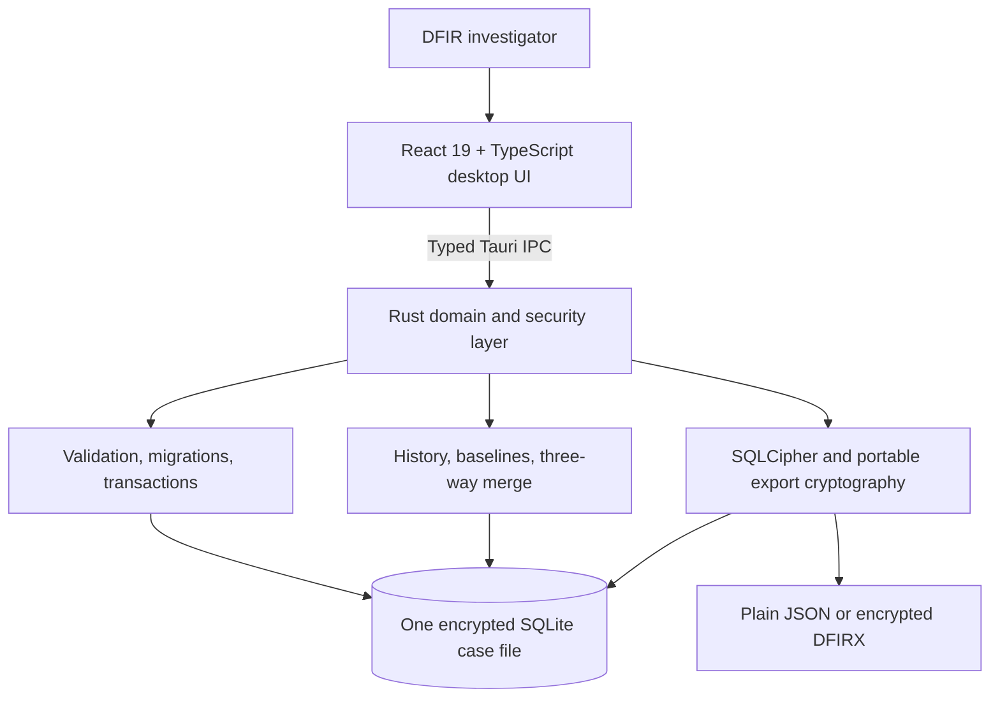

# DFIR Network Investigator: Technology and Capability

## An offline, encrypted workbench for coordinated incident investigation

DFIR Network Investigator gives response teams a portable place to build, protect, and reconcile a common operating picture when a client has no usable SIEM, no shared investigation platform, or no network connectivity suitable for cloud tooling.

It combines a React desktop experience with a Rust security and data layer, an encrypted SQLCipher case database, evidence-aware time normalization, and Git-like expert change review. Each investigator can work independently on a laptop, retain custody of a complete case file, and merge reviewed findings at the end of a shift without blindly overwriting another expert's work.

The product is deliberately focused: it organizes and protects investigator knowledge. It does not pretend that manually documented topology is packet-derived truth, that chronology proves causality, or that an unverified hypothesis is evidence.

## The operational problem it solves

Third-party DFIR teams frequently arrive in environments where:

- the client's logs are distributed across systems;
- clocks are wrong or expressed in inconsistent timezones;
- asset and network documentation is incomplete;
- several experts must work in parallel without a central server;
- sensitive case data must remain on controlled endpoints; and
- end-of-day consolidation is performed manually through notes and spreadsheets.

DFIR Network Investigator replaces that fragmented process with a structured, versioned case model. It records what is known, what remains uncertain, who changed it, and how conflicting expert findings were resolved.

## Technology architecture

There is no application server, database server, browser-accessible API, account service, or required cloud dependency. The deployed application is a native Tauri desktop package with a local React interface and an in-process Rust backend.

This design provides:

- operation in disconnected or restricted environments;
- low deployment and administration overhead;
- direct investigator custody of case files;
- a smaller remote attack surface than a hosted service; and
- portable native builds for Windows, Linux, and macOS.

## Core technical capabilities

### Encrypted case lifecycle

Each case is one user-selected SQLCipher-encrypted SQLite database. The application applies the password through SQLCipher's native key API before attempting to read the schema.

The lifecycle includes:

- encrypted case creation;
- password-required unlock;
- rejection of plaintext SQLite files during the normal open flow;
- in-place SQLCipher rekey;
- explicit lock and close;
- schema migration and compatibility repair;
- SQLCipher, SQLite integrity, and foreign-key checks; and
- non-destructive conversion of a legacy plaintext case into a new encrypted copy.

The password belongs to the physical database file. It is not derived from an expert name, stored in a global profile, or used as an application account credential.

### Structured investigation model

The database represents the elements needed to coordinate a network investigation:

- case and client metadata;
- logical network zones and asserted connections;
- assets, compromise state, investigation progress, operating system, user, IP, and MAC data;
- multiple interfaces for multi-homed assets;
- dedicated firewalls with multiple interfaces and addresses;
- structured VIP, DNAT, SNAT, and port mappings;
- normalized imported router/switch/firewall configurations with interfaces, VLANs, routes, ACL/security rules, and NAT evidence;
- normalized ESXi/vSphere, Proxmox VE, and Hyper-V guest inventory as ordinary assets with stable vendor identity, provenance, runtime/resource metadata, and discovered NICs;
- case-level physical/logical connectivity compliance assertions and evidence-linked possible-path analysis;
- timeline events and reusable clock-correction profiles;
- indicators of compromise;
- Markdown findings and hypotheses; and
- expert commits, entity revisions, baselines, and merge history.

Stable UUIDs identify entities across history, exports, and merges. Names and addresses can change or collide; stable IDs prevent two similarly named systems from being silently treated as the same endpoint.

### Evidence-aware time correlation

Incident timelines often fail when tools overwrite the source time with a corrected value. This application retains both the evidence and its interpretation:

- the raw timestamp reported by the source;
- the source timezone or declared offset;
- the normalized server interpretation in UTC;
- an optional trusted reference observation;
- the calculated clock correction;
- the corrected incident time;
- timestamp precision; and
- source, severity, MITRE context, and optional stable asset relationship.

The applied correction is copied into the event. A later edit to a reusable clock profile cannot silently rewrite an already recorded event. This preserves provenance while still allowing investigators to compare evidence on a normalized UTC timeline.

### Git-like expert merge without a server

Experts can receive identical copies of a shared baseline, work independently, and export only the changes made after that baseline.

A change bundle contains:

- case, bundle, baseline, and expert-head identifiers;
- ordered commits and history parents;
- expert name, session, time, and optional work scope; and
- before-and-after entity values.

The receiving investigator gets a three-way comparison of baseline, current master, and incoming values. The review identifies clean changes, automatic field merges, deletions, already-applied changes, and same-field conflicts. Investigators can select records and resolve conflicts field by field before one transaction commits the accepted result.

Different case IDs, unknown baselines, and repeated bundles are not silently accepted. This makes distributed work reviewable without claiming to provide real-time collaboration or cryptographic identity.

### Controlled human, script, and LLM intake

The application can generate a case-aware JSON template for a human analyst, another tool, or an LLM. Submitted data is never applied directly from the frontend.

The Rust layer:

1. Parses the document into typed entities.
2. Validates fields and relationships.
3. Executes a rollback-only dry run.
4. Classifies proposed records as create, update, unchanged, or invalid.
5. Presents the proposal for selective review.
6. Revalidates immediately before confirmation.
7. Rejects stale previews or missing dependencies.
8. Applies the approved subset and its history commit atomically.

This enables assisted data entry while keeping the investigator responsible for evidence quality. Generated text is input for review, not automatically trusted evidence.

The network-device and virtual-machine importers use this same control boundary. Browser-side adapters parse investigator-selected text into vendor-neutral records, perform deliberately narrow identity matching against the open case, and generate a case-bound partial-import proposal. Rust still performs the authoritative validation, rollback-only dry run, stale-preview check, transactional write, and attributed history commit. No importer connects to a firewall, switch, router, or hypervisor.

### Portable and protected exchange

Snapshots and expert bundles can be saved as ordinary JSON for interoperability or as password-encrypted `.dfirx` files for controlled transfer.

The encrypted envelope uses:

- Argon2id version 19 for password-based key derivation;
- 64 MiB of KDF memory and three iterations;
- a fresh random 16-byte salt;
- AES-256-GCM authenticated encryption;
- a fresh random 12-byte nonce;
- authenticated format metadata; and
- fixed parameter and input-size validation before expensive processing.

Argon2id raises the cost of offline password guessing. AES-GCM protects confidentiality and detects an incorrect password or modified ciphertext. The export password is independent of the database password, allowing separate controls for the working database and material sent to another investigator.

Encryption does not prove authorship: anyone with the shared export password can create a valid encrypted envelope. Organizations requiring non-repudiation should add a digital-signature workflow.

## Why sensitive-memory zeroing matters

Releasing a normal string does not guarantee that its previous bytes are overwritten. A database password or derived encryption key can remain in unused heap memory until the allocator reuses that area.

The Rust backend wraps database passwords, export passwords, and derived AES keys in `Zeroizing<T>`. When the value leaves scope, including through an error return, its controlled memory is overwritten before being released.

This provides practical defense in depth:

- shortens the lifetime of recoverable secrets in process memory;
- reduces exposure in later memory dumps and reused allocator pages;
- applies cleanup consistently across normal and error paths; and
- prevents the application from retaining a database or export password as long-lived state.

Zeroing is secret-lifetime reduction, not memory encryption. It cannot guarantee removal from JavaScript strings, IPC buffers, operating-system paging, library-internal copies, or memory inspected while the secret is actively being used. React clears password fields after operations, but JavaScript runtimes do not provide deterministic memory zeroization. Endpoint controls such as BitLocker, FileVault, process protection, patching, and physical custody remain necessary.

## Security engineering decisions

| Decision | Operational benefit | Explicit boundary |
|---|---|---|
| Offline Tauri architecture | No server deployment and reduced remote attack surface | No central management or live synchronization |
| SQLCipher case database | Encrypts and authenticates a closed case at rest | An unlocked process must handle plaintext |
| Separate database/export passwords | Separates workstation storage access from transferred-file access | Users must manage both secrets safely |
| Rust-side validation | One authoritative boundary for database mutations | Cannot determine whether human-provided evidence is true |
| Transactions and dry runs | Prevents partially applied imports and merges | Users can still approve a factually incorrect proposal |
| Three-way merge | Preserves independent work and exposes conflicts | Expert names are operational attribution, not verified identity |
| Stable UUID identity | Reliable history and merge behavior despite renamed assets | UUID possession does not prove authenticity |
| Raw plus corrected time | Preserves evidence provenance and enables correlation | Correction quality depends on the reference observation |
| Restricted Tauri capabilities | Limits the frontend to required native capabilities and dialogs | Does not protect a compromised operating system |
| Local-only content security policy | Reduces script and remote-content injection exposure | Native command validation is still required |
| Safe Markdown preview | Notes cannot execute embedded HTML | Intentionally less expressive than arbitrary HTML |
| Bundled SQLCipher/OpenSSL | No separately installed database engine or crypto runtime | Cold native builds, especially Windows OpenSSL, are slower |

## User capability

An investigator can use the application to:

- create, unlock, rekey, lock, and reopen encrypted case databases;
- record networks, endpoints, multi-homed interfaces, firewalls, NAT, and asserted connectivity;
- import Palo Alto, OPNsense, Juniper, OpenWrt, and Cisco device configurations through six initial role profiles;
- import ESXi/vSphere, Proxmox VE, and Hyper-V VM lists from supported native text, JSON, or CSV into Assets and PC Configuration;
- track compromise and investigation status across the asset inventory;
- visualize topology with multiple layouts and export it as PNG;
- check persisted physical/logical isolation requirements and enumerate possible inbound/outbound paths;
- preserve source timestamps and correlate incorrect server clocks;
- create, edit, search, and filter timeline events, IOCs, and notes;
- retain hypotheses and uncertainty without presenting them as conclusions;
- export interoperable snapshots or password-protected portable files;
- exchange attributed changes from a shared baseline;
- review clean edits, deletions, and field conflicts before merging;
- preview and selectively accept structured partial imports; and
- render supported exports as read-only text for review or printing.

The result is a common operating picture that remains usable when specialists must work independently and reconnect their findings later.

## Engineering and delivery capability

The codebase separates frontend presentation, Tauri commands, database operations, secure database lifecycle, portable cryptography, partial import, and history/merge logic. Important multi-record operations use explicit transaction boundaries, and schema evolution is managed through `PRAGMA user_version` migrations.

The repository currently includes:

- strict TypeScript production compilation;
- ESLint and Vitest tooling;
- 61 frontend behavioral and domain tests;
- 51 Rust unit and integration-style tests in the shared core/server suite;
- SQLCipher creation, wrong-password, rekey, and migration tests;
- cryptographic round-trip and modification-detection tests;
- merge conflict, repeated-bundle, and unknown-baseline tests;
- transactional partial-import scenario tests; and
- a manual GitHub Actions release matrix for all desktop platforms.

Release outputs include:

- Windows x64 NSIS installer and standalone executable;
- Linux x86_64 Debian package and AppImage; and
- macOS universal Intel/Apple Silicon application archive and DMG.

The build workflow is manual so ordinary commits do not spend release-runner time. Native Rust output caching reduces repeated compilation, although changes to dependency fingerprints can still cause a cold SQLCipher/OpenSSL build.

For stronger release governance, lint, frontend tests, Rust formatting, and Rust tests should become mandatory CI jobs before packaging. Public macOS distribution also requires organizational Apple signing and notarization credentials.

## Honest capability boundaries

DFIR Network Investigator does not currently perform:

- automated endpoint discovery or evidence collection;
- live network observation or packet-derived topology;
- automatic log ingestion and parsing;
- vulnerability scanning or YARA execution;
- complete vendor-semantic policy compilation, dynamic routing/VRF/PBR/VPN state, rule shadowing, or application-aware effective-policy simulation;
- live hypervisor discovery, VM disk/configuration collection, or proof that an exported VM runtime state is current;
- proof that a modeled path carried traffic, or automatic malware causality inference;
- application accounts, verified authentication, or RBAC;
- real-time multi-user database editing;
- cryptographic signatures for expert identity or bundles;
- formal task and due-date management;
- standardized final PDF report generation; or
- database-password recovery or organizational key escrow.

These are intentional boundaries, not hidden claims. The software records and reconciles what investigators establish; it does not manufacture certainty that the evidence does not support.

## Why this approach is valuable

Many investigation tools optimize for automated collection at scale. DFIR Network Investigator addresses a different failure point: what happens after several people have partial evidence, inconsistent timestamps, changing topology knowledge, and no trusted shared workspace.

Its value comes from combining:

- offline portability;
- encrypted local custody;
- a structured network-investigation model;
- evidence-preserving time correction;
- reviewable distributed collaboration;
- controlled import of human- and machine-produced information; and
- explicit separation between documented facts, hypotheses, and software-generated conclusions.

It is a lean, security-conscious coordination layer for teams that need their investigation record to remain portable, reviewable, and technically defensible.

## License

DFIR Network Investigator is licensed under the GNU Affero General Public License v3.0 only (`AGPL-3.0-only`). Third-party components remain under their respective licenses as documented in `THIRD_PARTY_NOTICES.md`.
